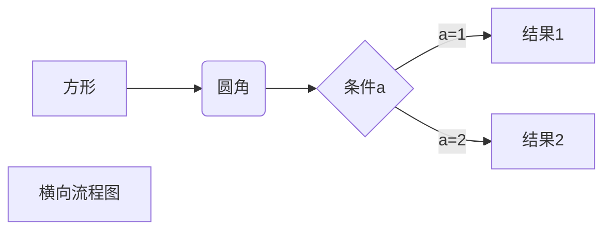

# <div align="center">md教程</div>

<span id='date'>2023-08-03</span>
<span class='tag'>markdown</span><span class='tag'>教程</span>

## 简介
- Markdown语言是一种轻量级标记语言，它允许人们使用易读易写的纯文本格式编写文档。
- Markdown语言在 2004 由约翰·格鲁伯（英语：John Gruber）创建
- Markdown 编写的文档后缀为 .md, .markdown

## 标题
- 使用`=`和`-`标记一级和二级标题
```
我是一级标题
====
我是二级标题
------
```

- 使用`#`号可表示 1-6 级标题
```
# 一级标题
## 二级标题
### 三级标题
#### 四级标题
##### 五级标题
###### 六级标题
```


## 段落
- 段落的换行是使用两个以上空格加上回车
1. 字体

```
*斜体文本1*
_斜体文本2_
**粗体文本1**
__粗体文本2__
***粗斜体文本1***
___粗斜体文本2___
```

- *斜体文本1*
- _斜体文本2_
- **粗体文本1**
- __粗体文本2__
- ***粗斜体文本1***
- ___粗斜体文本2___

2. 分隔线
- 一行中用三个以上的星号、减号、底线来建立一个分隔线，行内不能有其他东西
- 可以在星号或是减号中间插入空格

```
***
* * *
*****
- - -
----------
```

3. 删除线

- 两端加上两个波浪线`~~`即可
```
wh~~eyu~~
w~~he~~yu
~~wheyu~~
```
- wh~~eyu~~
- w~~he~~yu
- ~~wheyu~~

3. 下划线
- 通过HTML的`<u>`标签实现
```
这是<u>下划线</u>文本
```

这是<u>下划线</u>文本

5. 脚注
- 脚注是对文本的补充说明
```
[^看我]: 这是脚注内容
```

查看 [^看我]: 这是脚注内容

[^看我]: 这是脚注内容哦
[^111]: 2222

---
## 列表
- 支持有序列表和无序列表
  - `无序列表` 使用星号(*)、加号(+)或是减号(-)作为列表标记，这些标记后面要添加一个空格
  - `有序列表` 使用数字并加上 . 号来表示

```
1. 第一项：
    - 第一项嵌套的第一个元素
    - 第一项嵌套的第二个元素
2. 第二项：
    - 第二项嵌套的第一个元素
    - 第二项嵌套的第二个元素
```

1. 第一项：
    - 第一项嵌套的第一个元素
    - 第一项嵌套的第二个元素
2. 第二项：
    - 第二项嵌套的第一个元素
    - 第二项嵌套的第二个元素

## 区块
- 在段落开头使用`>`符号,然后后面紧跟一个空格符号
```
> 最外层
> > 第一层嵌套
> > > 第二层嵌套
> 区块中使用列表
> 1. 第一项
> 2. 第二项
> + 第一项
```
> 最外层
> > 第一层嵌套
> > > 第二层嵌套
> 区块中使用列表
> 1. 第一项
> 2. 第二项
> + 第一项

## 代码
- 段落上的一个函数或片段的代码可以用反引号把它包起来(`)
- 使用 4 个空格或者一个制表符（Tab 键）
- 用 ``` 包裹一段代码，并指定一种语言（也可以不指定）
```
`printf()` 函数

    代码

\```javascript
$(document).ready(function () {
    alert('wheyu');
});
\```
```
`printf()` 函数

    代码

```javascript
$(document).ready(function () {
    alert('wheyu');
});
```

## 链接
- 使用方法:  `[链接名称](链接地址)`
- 直接使用链接地址: <https://wheyu.github.io/>

```
链接：[wheyu blog](https://wheyu.github.io/)
```

链接：[wheyu blog](https://wheyu.github.io/)

- 高级链接: `[wheyu blog][1]`

```
链接：[wheyu blog][1]
```
链接：[wheyu blog][1]

[1]: https://wheyu.github.io/

## 图片
- 语法格式: ``

## 表格
- 使用`|`来分隔不同的单元格，使用`-`来分隔表头和其他行

```
|  表头   | 表头  |
|  ----  | ----  |
| 单元格  | 单元格 |
| 单元格  | 单元格 |
```

|  表头   | 表头  |
|  ----  | ----  |
| 单元格  | 单元格 |
| 单元格  | 单元格 |

- 对齐方式
  - -: 设置内容和标题栏居右对齐
  - :- 设置内容和标题栏居右对齐
  - :-: 设置内容和标题栏居右对齐

```
| 左对齐 | 右对齐 | 居中对齐 |
| :-----| ----: | :----: |
| 单元格 | 单元格 | 单元格 |
| 单元格 | 单元格 | 单元格 |
```

| 左对齐 | 右对齐 | 居中对齐 |
| :-----| ----: | :----: |
| 单元格 | 单元格 | 单元格 |
| 单元格 | 单元格 | 单元格 |


$$
\begin{Bmatrix}
   a & b \\
   c & d
\end{Bmatrix}
$$
$$
\begin{CD}
   A @>a>> B \\
@VbVV @AAcA \\
   C @= D
\end{CD}
$$

